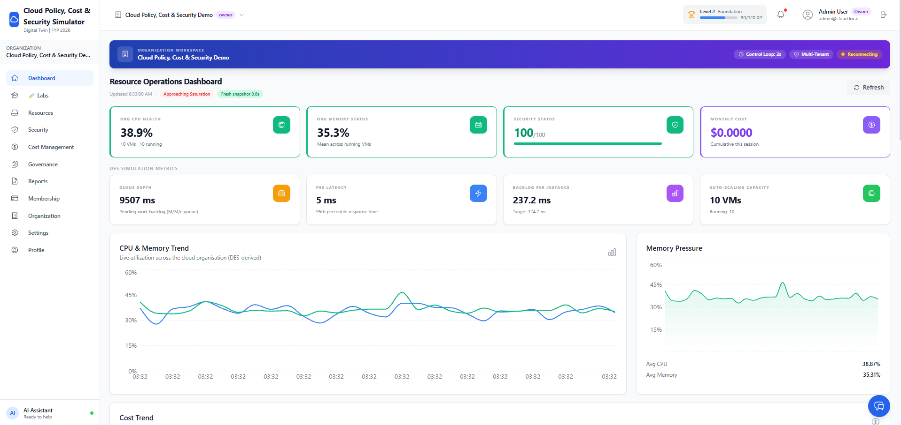

# ☁️ Cloud Policy, Cost & Security Simulator

### A Digital Twin Platform for Learning Cloud Operations, Governance, FinOps & Security
Feb 2026 – Apr 2026

<p align="center">
  
</p>

---

## 🌐 Overview

The Cloud Policy, Cost & Security Simulator is a web-based Digital Twin platform developed as a university capstone project. It simulates cloud resources, security events, governance policies, and cost management so users can explore cloud operations without needing access to a real cloud environment.

Instead of deploying infrastructure on AWS, Azure, or Google Cloud, the platform creates a simulated environment where users can manage resources, monitor activity, apply policies, analyze costs, and observe security events in one place.

The goal is to make cloud concepts easier to understand through hands-on interaction while avoiding the cost and complexity of production cloud platforms.

---

## ✨ Features

### 🔐 Identity & Organization Management

- User authentication
- Organization management
- Role-based member management
- Profile management

### ☁️ Cloud Resource Simulation

- Virtual machines
- Databases
- Resource lifecycle simulation
- Synthetic telemetry generation

### 📊 Monitoring Dashboard

- Resource metrics
- Infrastructure status
- Operational dashboards
- System visualization

### 🛡️ Security Monitoring

- Threat detection
- Security alerts
- Risk summaries
- Incident monitoring

### 📜 Governance & Policies

- Policy management
- Compliance checks
- Governance scoring
- Audit tracking

### 💰 Cost Management

- Cost analysis
- Budget visualization
- Resource usage insights
- Cost forecasting

### 📑 Reports

- Security reports
- Cost reports
- Activity history
- Operational summaries

---

## 🏗️ System Architecture

```text
                    User
                     │
              React Frontend
                     │
               REST API Layer
                     │
              Flask Backend
                     │
      ───────────────────────────
      │            │            │
 Authentication  Simulation  Security
                     │
             PostgreSQL Database
                     │
      AI Models + Synthetic Data
```

---

## 🧩 Project Modules

### Completed

- ✅ Authentication
- ✅ Organization Manager
- ✅ Data Generator
- ✅ Resource Simulator
- ✅ Resource Viewer
- ✅ Threat Detector

### In Progress

- 🚧 Policy Engine
- 🚧 Cost Forecaster
- 🚧 Report Generator
- 🚧 Remediation Agent
- 🚧 Audit Trail
- 🚧 User Settings

---

## 🛠️ Technology Stack

### Frontend

- React
- JavaScript
- Tailwind CSS
- Redux

### Backend

- Python
- Flask
- REST APIs

### Database

- PostgreSQL

### AI & Security

- Machine Learning
- Synthetic telemetry
- Security event simulation

---

## 📂 Repository Structure

```text
Cloud-Policy-Cost-and-Security-Simulator/

├── backend/
├── frontend/
├── docs/
├── start_backend.bat
├── start_frontend.bat
└── start_all.bat
```

---

## 📸 Screenshots

### Dashboard


### Security Monitoring


### Resource Simulation


---

## 📚 Documentation

Project reports, diagrams, screenshots, and demonstration material are available in the `docs/` directory.

---

## 🚀 Future Work

Planned improvements include:

- More realistic cloud workloads
- Better threat detection
- Automated remediation
- Expanded governance features
- Additional learning scenarios

---

## 🎓 Academic Context

**Project Type:** Final Year Project

**Domain:** Cloud Computing • Cybersecurity • Digital Twins • Cloud Governance

This project explores how simulation can provide practical cloud learning without relying on production cloud infrastructure.

---

## 👩‍💻 Authors

**Maryam Shahzad**

Computer Science Undergraduate

**Project Team Members**

- Muhammad Abdur Rehman Khan
- Wasfa Nauman Bhatti

---

⭐ Feel free to explore the project, documentation, and source code.
